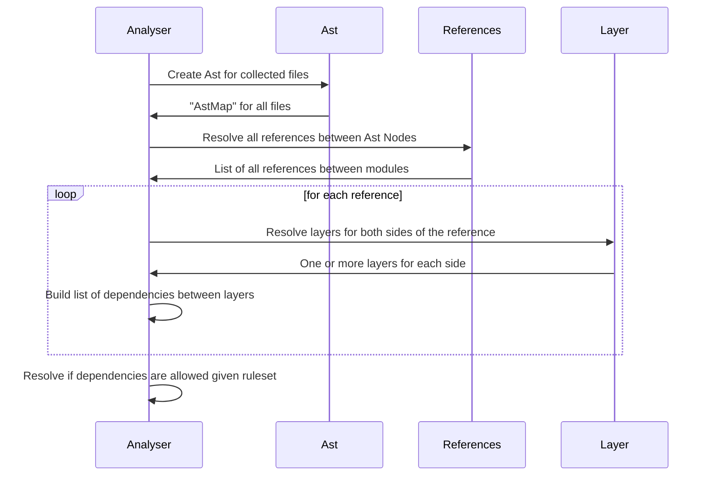

# Contributing to DepTracPy

There are many ways to contribute to DepTracPy, from helping others with their issues, improving the documentation to 
fixing bugs & adding new features. The maintainers and contributors will help you best as they can, when you have
questions or troubles. Feel free to reach out.

When you want to add a new feature to DepTracPy, please make sure to open an issue first to let others know who is 
working on it and prevent similar or conflicting pull requests. We are always happy to expand the possibilities of 
DepTracPy to better fit the need of anyone who uses it. Before we merge changes, we have to decide whether we can 
maintain them without taking away resources needed elsewhere. Unfortunately, that means we have to reject some change 
requests. Opening an issue before you start working on any new feature will make sure your merge request can be accepted.

### Code style

You can check if your code changes are in line with our coding guidelines using flake8 and black.

```
make lint
```

This will show you any code style violations. You can automatically fix them by running:

```
make format
```

### Static code analysis

In order to perform static code analysis for your changes you can run:

```
make sa
```

## DepTracPy Core Engine (Internals)

The internal DepTracPy engine consists of several parts (`Analyser`, `Ast`, `Layer`, `References`). To give you a brief
overview of how the pieces lock together, see the diagram of an individual run:



### Ast

The Ast module is responsible for parsing all the provided files and building an (Abstract) Syntax Tree (AST) for those
files. We use [`LibCST`](https://github.com/Instagram/LibCST) for generating it.

The result is an `AstMap` containing all occurrences of found files and calls made between them.

### References

The References module is concerned with taking the generated `AstMap` and converting it into a `List[Reference]` of
applicable references between Ast nodes.

### Layers

As the name suggests, this module resolves what layers should each token be a part of. It leverages
the [collectors](collectors.md) defined in the [`layers`](configuration.md#layers) section of the configuration.

### Analyser

The Analyser orchestrates between these modules. It calls the `Ast` and `References` modules to generate a list of 
relevant references between parts of your code and utilizes `Layers` module to match the to their layers. 

It then compares them against the [`deptrac.ruleset`](configuration.md#ruleset) section of the configuration and 
finally generates an `AnalysisResult` which will be returned in the output.

The `AnalysisResult` is a collection of `Allowed`, `Error`, `Warning`, and `Violation` rules. Those are then 
processed by the [`OutputFormatter`](formatters.md) to give you the desired output you can see when you call a command.
