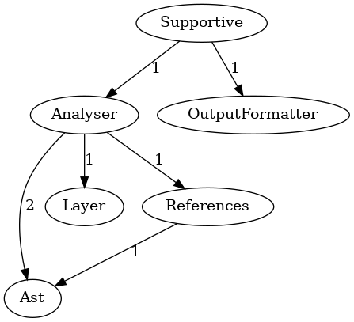

## What is DepTracPy?

DepTracPy is a static code analysis tool for Python that helps you communicate, visualize and enforce architectural 
decisions in your projects. You can freely define your architectural layers over modules and which rules should apply to
them. It is a sister project to a same tool written for PHP - [Deptrac](https://github.com/qossmic/deptrac).

For example, you can use DepTracPy to ensure that packages/modules in your project are truly independent of each other 
to make them easier to test and reuse.

DepTracPy can be used in a CI pipeline to make sure a pull request does not violate any of the architectural rules you 
defined. With the optional Graphviz formatter you can visualize your layers, rules and violations.



### Optional Dependency: Graphviz

If you want to create graphical diagrams with your class dependencies, you will also need the `dot` command provided by 
[Graphviz](http://www.graphviz.org/).

Graphviz can be installed using common package managers:

```bash
# for macos + brew
brew install graphviz

# for ubuntu and debian
sudo apt-get install graphviz
```

Graphviz is also available for [Windows](https://graphviz.gitlab.io/_pages/Download/Download_windows.html).
Install the current stable release and append the binary path on the environment
variable Path (e.g. ``C:\Program Files (x86)\Graphviz2.38\bin``).

## Getting Started

In order to get started with DepTracPy you will need a configuration file. This configuration file is written in YAML 
and, by default, is stored with the name `deptracpy.yaml` in your project's root directory.

The main purpose of this file is:

1. Define in which directories DepTracPy will search for your code
2. Define your architectural layers using so-called collectors.
3. Define a ruleset describing which layers can communicate with each other.

You can find out more about the [Core Concepts](concepts.md) in the docs.

### Configuration

Let's have a look at the generated file:

```yaml
# deptracpy.yaml
paths:
  - src

layers:
  - name: Analyser
    collectors:
      - type: ModuleRecursive
        path: 'deptracpy.Core.Analyser'
  - name: Ast
    collectors:
      - type: ModuleRecursive
        path: 'deptracpy.Core.Ast'
  - name: Layer
    collectors:
      - type: ModuleRecursive
        path: 'deptracpy.Core.Layer'
  - name: References
    collectors:
      - type: ModuleRecursive
        path: 'deptracpy.Core.References'
  - name: Contract
    collectors:
      - type: ModuleRecursive
        path: 'deptracpy.Contract'
      - type: Module
        path: 'deptracpy'


rulesets:
  Analyser:
    - Ast
    - Layer
    - References
    - Contract
  References:
    - Ast
    - Contract
  Layer:
    - Contract
```

DepTracPy will search your project's `src/` directory for modules and packages.

We then define 5 layers by searching for module names in the files found by DepTracPy. Any file in the module and 
submodules of `deptracpy.Core.Analyser` will be grouped in a layer with the same name. The same happens for `Ast`, 
`Layer` and `Refe)rences` in their name. For `Contract` layer, any files in `deptracpy.Contract` and its submodules 
as well as files directly in the `deptracpy` module (like `__init__.py`) will be grouped.

The ruleset will then allow files in the `Analyser`-layer to communicate - i.e. use files from - the `Ast`, `Layer`, 
`References` and `Contract` layers. Files grouped in the `References` layer may not use files from the `Analyser` layer,
but they can use files from the `Ast` and `Contract` layers. Files inside the `Layer` layer may only use files from 
the `Contract` layer. Files in the `Contract` layer may not use any files from any other layer.

You can learn more about the file in the [Configuration reference](configuration.md).

## Run DepTracPy

Once you have set up the config file you can run DepTracPy to analyse your code and check for violations.

```bash
deptracpy
```
The generated output will roughly look like this:

```bash
                                                           Supportive                                                            
┌───────────┬───────────────────────────────────────────────────────────────────────────────────────────────────────────────────┐
│ Violation │ OutputFormatter: deptracpy.Supportive.entrypoint cannot depend on deptracpy.OutputFormatter.format.format_output. │
└───────────┴───────────────────────────────────────────────────────────────────────────────────────────────────────────────────┘
       Results        
┏━━━━━━━━━━━━┳━━━━━━━┓
┃            ┃ Count ┃
┡━━━━━━━━━━━━╇━━━━━━━┩
│ Allowed    │ 114   │
│ Warning    │ 0     │
│ Violations │ 1     │
│ Errors     │ 0     │
└────────────┴───────┘
0 errors and 1 violations found in the analysis.

Process finished with exit code 1
```

This is a report generated by DepTracPy. At the top you can see a list of violations, if there are any. A violation 
means that a layer uses a layer that  is prohibited by the configured ruleset. In this case, a file from the
`Supportive` layer uses a file from the `OutputFormatter` layer.

The table on the bottom gives you an overview over:

* **Allowed**: how many usages between layers were found that do not violate the ruleset.
* **Warning**: how many warnings where encountered, e.g. because a file is not in any layer.
* **Violations**: how many violations were found.
* **Errors**: how many errors were encountered, e.g. when a file is part of multiple layers.

You can also change the output format itself by using one of the many provided [Output Formatters](formatters.md).

## Contribute

DepTracPy is in active development. We are looking for your suggestions and help to make it better.

Feel free to **open an issue** if you encounter bugs, have suggestions or would like to add a new feature to DepTracPy.

Please feel free to improve this documentation, fix bugs, or work on a suggested
feature by making a pull request on GitHub. Don't hesitate to ask for support,
if you need help at any point.

* [Backwards Compatibility](bc_policy.md) - General info on how we approach backwards compatibility
* [Core Concepts](concepts.md) - Explains layers, rules and violations in more details.
* [Configuration](configuration.md) - Reference for all available settings in a config file
* [Collectors](collectors.md) - Reference for which collectors are available in DepTracPy to define your layers.
* [Formatters](formatters.md) - Lists the different output formats supported by DepTracPy
* [Code Of Conduct](CODE_OF_CONDUCT.md) - Our community standards
* [Contribute](CONTRIBUTING.md) - Advice for contributing code changes,
  e.g. how to run tests or how to build a phar file with your changes that you
  can use to analyse your projects
* [Security Guide](SECURITY.md) - How to report security vulnerabilities
